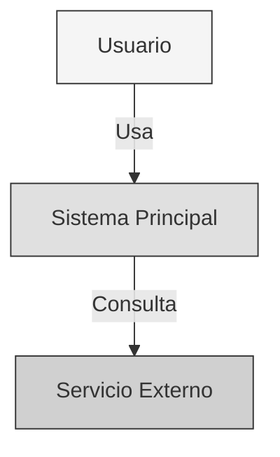
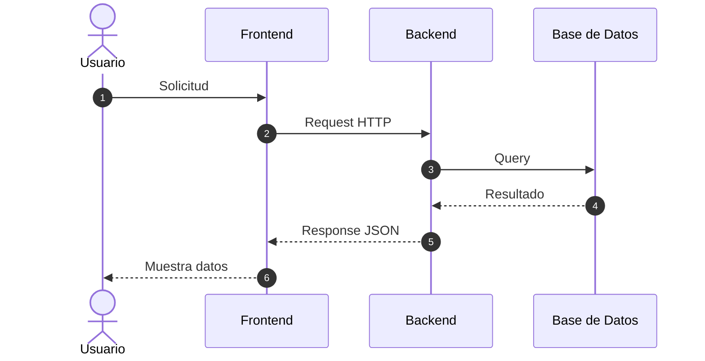
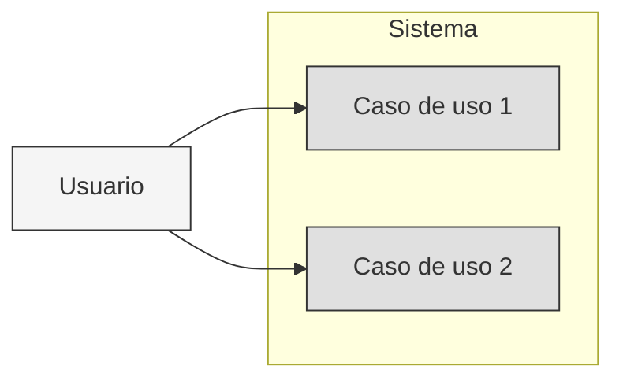

# Diagramación

## Sección en el documento

Los diagramas van embebidos en `docs/DOCUMENTACION.md` dentro de las secciones correspondientes.

---

## Qué diagramas generar

1. **Diagrama de contexto C4** (nivel 1) — Sistema, actores, sistemas externos
2. **Diagrama de contenedores C4** (nivel 2) — Apps, BDs, servicios
3. **Diagramas de secuencia** — Flujos principales
4. **Casos de uso** — Actores y funcionalidades

---

## TODOS los diagramas son Mermaid

Usar bloques ```mermaid en Markdown. NUNCA ASCII art.

---

## Colores (blanco y negro)

Para mantener el documento en blanco y negro, usar tonos de gris:

```mermaid
flowchart TD
    classDef actor fill:#F5F5F5,stroke:#333,color:#333
    classDef app fill:#E0E0E0,stroke:#333,color:#333
    classDef data fill:#FAFAFA,stroke:#333,color:#333
    classDef external fill:#D0D0D0,stroke:#333,color:#333
```

| Capa | Color | Uso |
|------|-------|-----|
| Actores | `#F5F5F5` | Usuarios, personas |
| Aplicación | `#E0E0E0` | Servicios, módulos |
| Datos | `#FAFAFA` | Bases de datos |
| Externos | `#D0D0D0` | Sistemas externos |

---

## Ejemplo: C4 Contexto

````markdown

````

---

## Ejemplo: Secuencia

````markdown

````

---

## Ejemplo: Casos de Uso

````markdown

````

---

## Reglas

- Todo en español
- Máximo 15 nodos por diagrama
- Usar emojis en nodos para identificar tipo (opcional)
- `sequenceDiagram` con `autonumber`
- `flowchart LR` para casos de uso
- `flowchart TD` para arquitectura
- Colores en escala de grises (blanco y negro)
